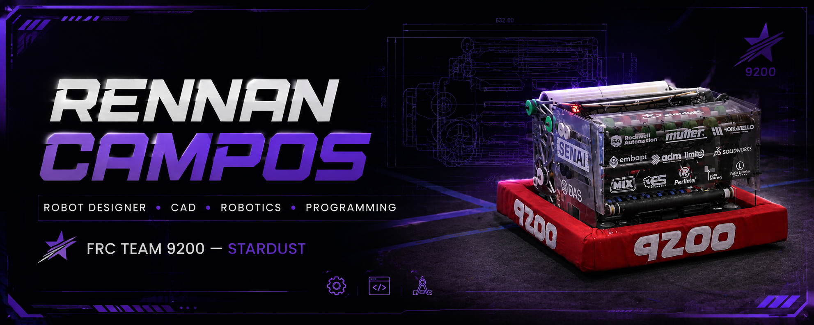

<p align="center">
  
</p>

<h1 align="center">RENNAN CAMPOS</h1>

<p align="center">
  <strong>ROBOT DESIGNER • CAD • ROBOTICS • PROGRAMMING</strong>
</p>

<p align="center">
   FRC Team 9200 — Stardust &nbsp; • &nbsp; 📐 Mechanical Design &nbsp; • &nbsp; 💻 Programming
</p>

---

##  About Me

I'm a technology student focused on **robotics, mechanical design, CAD and programming**.

I'm part of **FRC Team 9200 — Stardust**, where I work primarily with robot design, mechanical development and CAD.

My main interests are designing mechanisms, solving engineering problems and transforming ideas into functional and manufacturable systems.

I'm also expanding my programming skills in **Python and Java**, with the goal of combining mechanical engineering and software in robotics.

---

##  Quick Profile

*  **Robot Designer**
*  **CAD & Mechanical Design**
*  **FRC Team 9200 — Stardust**
*  **Robotics & Engineering**
*  **Python & Java**
* 🇧🇷 **Brazil**

---

##  FRC Team 9200 — Stardust

### Robot Designer

I work primarily with **robot design and mechanical development**, using CAD to transform concepts into functional mechanisms for competitive robotics.

My work involves areas such as:

* Mechanical design
* CAD modeling
* Mechanism development
* Robot assemblies
* Prototyping
* Design iteration
* Manufacturing-oriented design
* Mechanical integration

###  2026 FIRST Championship

**FRC Team 9200 — Stardust**

*  Location: Limeira, São Paulo, Brazil
*  Event: FIRST Championship 2026
* 🇺🇸 Location: Houston, Texas, USA

---

##  Awards & Recognition

*  Creativity Award — Regional Brazil / SESI Osasco
*  Creativity Award — Festival SESI de Educação

---

##  CAD & Mechanical Design

Mechanical design is one of my main technical focuses.

### Tools

* Autodesk Inventor
* SolidWorks

### Focus Areas

* 3D Modeling
* Mechanical Design
* Assemblies
* Mechanism Development
* Prototyping
* Design Iteration
* Manufacturing-oriented Design
* Robot Integration

> My goal is not only to make models that look good, but to develop designs that can actually be manufactured, assembled, tested and improved.

---

##  Featured Projects

###  Stardust 9200 — 2026 Robot

Mechanical design and CAD development for the 2026 FRC robot.

**Project documentation coming soon.**

---

###  Mechanical Design Projects

CAD studies and mechanical projects focused on robotics, mechanisms and engineering design.

**Projects coming soon.**

---

###  Programming Projects

Programming projects developed while studying software development and programming fundamentals.

**Projects coming soon.**

---

##  Programming

I'm currently expanding my programming skills with a focus on **robotics and software development**.

### Languages

* Python
* Java
* HTML

### Tools

* Git
* GitHub
* VS Code

---

## 🛠️ Tech Stack

### CAD & Engineering

`Autodesk Inventor` `SolidWorks`

### Programming

`Python` `Java` `HTML`

### Development Tools

`Git` `GitHub` `VS Code`

---

##  Currently Learning

* Advanced Autodesk Inventor
* Mechanical Design
* Engineering Documentation
* Python
* Java
* Git & GitHub
* Robotics Programming
* Manufacturing-oriented Design

---

##  My Journey

```text
Programming
     ↓
  Robotics
     ↓
Mechanical Design
     ↓
     CAD
     ↓
FRC Team 9200
     ↓
FIRST Championship 2026
     ↓
Engineering + Software
```

---

##  GitHub

I'm building this profile as a technical portfolio focused on **robotics, CAD, engineering and programming**.

The goal is to document not only the final result, but also the **design process, iterations, problems and solutions** behind each project.

---

##  Contact

* GitHub: [renancampos2001](https://github.com/)
* LinkedIn: **Coming soon**
* Email: **rennancampos2001@gmail.com**

---

<div align="center">

### Learn. Design. Build. Compete. Evolve.

</div>
